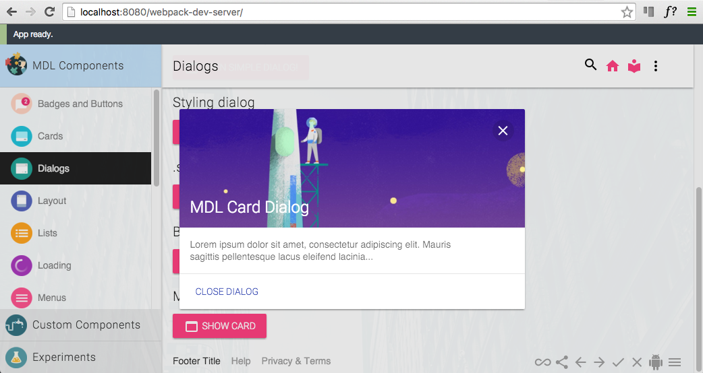
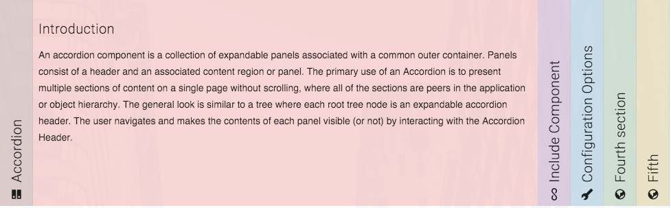
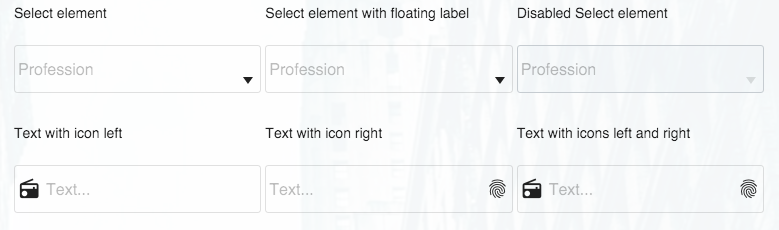
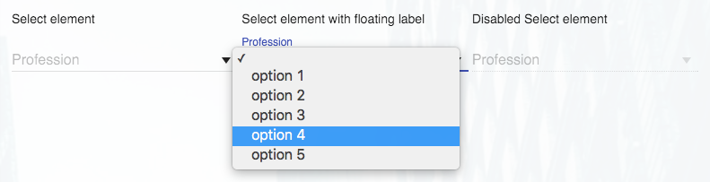

# MDL Webpack
A [Google Material Design Lite](http://www.getmdl.io/index.html) project built with NPM and Webpack using SASS and EcmaScript 2015/2016.



Material Design is a design language developed by Google. Expanding upon the "card" motifs 
that debuted in Google Now, Material Design makes more liberal use of grid-based layouts, responsive animations and 
transitions, padding, and depth effects such as lighting and shadows.

Material Design Lite lets you add a Material Design look and feel to your websites. It doesn’t rely on any JavaScript 
frameworks and aims to optimize for cross-device use,  and offer an experience that is immediately accessible


## What is included
A Material Design Lite project showcasing all components in MDL version 1.1.1. You can use SASS variables to modify all  
aspects of MDL - a typical use case is to configure fonts and color schemes. The project has selfhosting of font Roboto, 
Material Icons and Material Design Iconic Font - you don't need any external references in HTML. 

A few custom components are also hosted in this project (later they should move to their own repo).


## Why
Material Design Lite is a great SASS/CSS framework, but the pre built themes was not sufficient for my use. SASS with
Webpack provides control with all aspects of MDL and makes it easy to customize the design.


## Getting started
* [NodeJS](https://nodejs.org/en/) version 4.x or 5.x must be installed in advance and it is assumed that you have basic knowledge of NodeJS.
* Fork, clone or download ZIP
* CD to project root folder
* Install project dependencies: ```npm install```
* Start the project in development mode: ```npm run dev```
* Open a browser an hit: ```http://localhost:8080/webpack-dev-server/```
* Import the project into an IDE of your choice
* Open: ```./src/stylesheets/utils/_variables.scss``` 
* In the ```/* ==========  Color & Themes  ========== */``` section add the following code:

```sass
$color-primary: "63,63,63";
$color-primary-dark: "43,43,43";
$color-primary-contrast: "114,160,224";
$color-accent: "69,97,136";
$color-accent-contrast: "255,255,255";
```
* Save the modified file.
* If the Webpack Dev Server is running, you will (almost) immediately see the changes in your browser.


## Custom components
This project has a few custom components. 


### Accordion Component


An accordion component is a collection of expandable panels associated with a common outer container. Panels consist of 
a header and an associated content region or panel. The primary use of an Accordion is to present multiple sections of 
content on a single page without scrolling, where all of the sections are peers in the application or object hierarchy. 
The general look is similar to a tree where each root tree node is an expandable accordion header. The user navigates 
and makes the contents of each panel visible (or not) by interacting with the Accordion Header.

Credits: The Accordion component is based on this [CodePen](http://codepen.io/aann/pen/dPqBML)


### Bordered Input Fields Theme Component


Demonstrates how you can create your own theme of MDL text fields.

Credits: The Bordered Fields Theme component is based on this [CodePen](http://codepen.io/prajwal078/pen/LVJZXz)


### Select Element Component


The HTML ```<select>``` element represents a control that presents a menu of options. MDL does not provide it's own 
component for the ```<select>``` element.

Credits: The Select component is based on the following sources:
* [Material Design Lite selectfield component](https://github.com/mebibou/mdl-selectfield) 
* [mdl-selectfield](https://github.com/MEYVN-digital/mdl-selectfield)
* [Simple Material Design Login, with select field](http://codepen.io/michaelschofield/pen/qEzWaM)
* [Material Design &lt;select&gt; element, css only](http://codepen.io/pudgereyem/pen/PqBxQx)


## Polyfills


### Details Element Polyfill


The ```<details>``` element specifies additional details that the user can view or hide on demand. The ```<summary>``` 
element defines a visible heading for the ```<details>``` element. The heading can be clicked to view/hide the details.

The ```<details>``` element currently has very limited cross-browser support. To ensure support across all modern browsers, 
please consider using a polyfill or creating your own. I wrote my own polyfill using the following sources:

* https://github.com/jordanaustin/Details-Expander
* https://github.com/chemerisuk/better-details-polyfill
* http://codepen.io/stevef/pen/jiCBE
* http://blog.mxstbr.com/2015/06/html-details/
* http://html5doctor.com/the-details-and-summary-elements/
* http://zogovic.com/post/21784525226/simple-html5-details-polyfill
* http://www.sitepoint.com/fixing-the-details-element/
* https://www.smashingmagazine.com/2014/11/complete-polyfill-html5-details-element/


#### How to use the polyfill
Import the polyfill into your main javascript module.

```javascript
import { polyfillDetails } from './js/polyfills/details/details';
```

If you load HTML fragments dynamically, e.g. in a single page application, then you must call the polyfill after loading the HTML.

```javascripy
polyfillDetails(content);
```

Where ```content``` is the parent node of the loaded HTML fragment.


##### NOTE
This project is still in it's early stages.

As part of my work I review the usability of MDL as a SASS framework for both internal and public projects. 
In the coming months we plan to use MDL in some of our internal projects. At the same time, I plan to expand this 
project so that it can run as part of the actual frontend project. In this way it will be easy for web designers to 
make changes in design and simultaneously verify that the changes are as expected for all aspects of the design.
